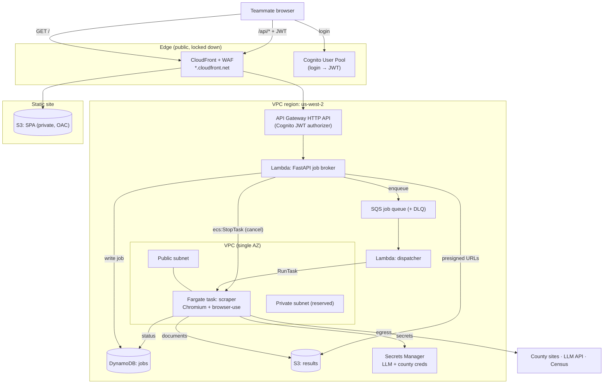
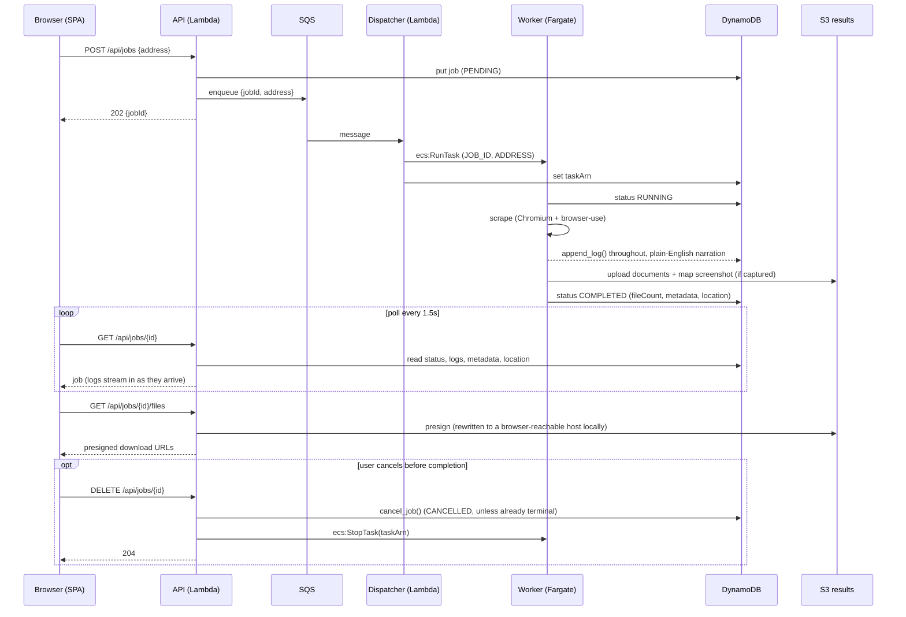
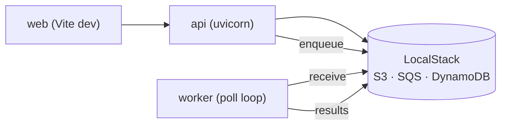
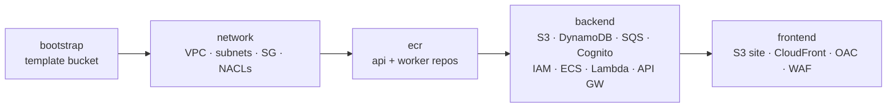

# Architecture

This document describes the AWS deployment of survey-art: a locked-down
web app where a small team submits a property address and gets back the recorded
documents a surveyor needs. It is **serverless-first, low-cost, and Well-Architected**,
with everything defined in CloudFormation.

## Design goals & key decisions

| Concern | Decision | Why |
|---|---|---|
| API compute | FastAPI as a **Lambda container** (Lambda Web Adapter) | Scales to zero; the same image runs locally under uvicorn |
| Scraper compute | **Fargate** task (Chromium + browser-use) | Long-running browser jobs exceed Lambda's limits |
| Scraper egress | **Public subnet**, public IP, no inbound | Avoids NAT Gateway cost (~$32/mo) |
| Access control | **Cognito** login (JWT) at API Gateway | Managed, free-tier, password-protected |
| Data | **DynamoDB** (jobs) + **S3** (documents) | No relational DB needed; both serverless |
| Deploy auth | Your own **local AWS credentials** (SSO/profile) | Deploys run from your machine only — no CI identity |
| IaC | **CloudFormation** in 5 stacks + boto3 change-set harness | Reviewable, repeatable, ordered |

Idle cost is ≈ **$0** (everything scales to zero / free tier); you pay per scrape
(a few minutes of one small Fargate task) plus ~$0.40/mo for the Secrets Manager secret.

## Component / request flow (AWS)



## Job lifecycle



**Live progress, not push.** "Real-time" logs are implemented as tightened polling
(1.5s) plus a running `logs: list[str]` field on the job record — not a websocket or
SSE stream. The worker appends one line per milestone via `append_log()`; the API just
returns whatever's accumulated so far on each poll. A true push channel is a possible
future upgrade if 1.5s polling ever feels laggy.

**Two log streams, one job record.** The worker's Python logger hierarchy has
`survey_art.*` (existing detailed dev/SOP diagnostics — untouched) and a child logger
`survey_art.narration` (new, curated, plain-English milestones like "Reading the
county's property report page..."). Both propagate to the same streaming handler
attached to `survey_art`, so both land in `logs`, interleaved by time — the narration
lines are simply additive, not a replacement for the diagnostic ones.

**Why logging can't call DynamoDB directly.** An early version of the log-streaming
handler called `jobs.append_log()` (a blocking network round-trip) synchronously inside
`emit()`. Since Python dispatches to log handlers on the calling thread, this stalled
the scraper's asyncio event loop on every log line, which was subtle enough to perturb
Playwright's timing-sensitive waits and cause flaky scrape failures. The fix (see
`_JobLogHandler`/`_DynamoLogHandler` in `apps/worker/survey_art/worker.py`) uses the stdlib
`logging.handlers.QueueHandler`/`QueueListener` pair: `emit()` only enqueues (fast,
non-blocking), and a dedicated background thread drains the queue and does the actual
DynamoDB write. Any future handler that talks to a network service from inside the
scraper's logging path should follow the same pattern.

**Property metadata** comes from `overview.json`, a per-property JSON file the Weld
scraper already builds incrementally while it runs (parcel identify results, property
report sections, document history, decision matrix, map info, etc.) — the worker loads
it (`_load_overview()`) after the scrape finishes and stores it verbatim as the job's
`metadata` field. No new schema was invented; other counties simply won't populate
`metadata` until/unless they grow their own `overview.json`.

**Map tab** shows, in priority order: (1) a scraper-captured screenshot of the county's
live parcel-boundary map if one exists (`metadata.map.image_url`, an S3-hosted PNG —
see the "why we screenshot" note in
[`docs/weld_county_sop.md`](weld_county_sop.md)), (2) a Google Maps embed pinned and
zoomed to the geocoded lat/lon (`location`, added to `GeocodedAddress` in
`geocode.py`), (3) a plain address-based Google Maps search as a last resort, or (4) a
"no location yet" message.

## Local development (docker-compose)

The same api and worker images run locally against **LocalStack** (S3 + SQS +
DynamoDB + Secrets Manager). Cognito isn't in LocalStack community, so the SPA runs
with **auth disabled** and the API has no authorizer in front of it locally.



`make up` starts all four containers; the worker runs a SQS poll loop (standing in
for the dispatcher Lambda + ECS RunTask that exist only in AWS).

## Repository layout

```
apps/
  api/         FastAPI job broker (Lambda container)         → survey-api package
  web/         React + Mantine SPA (S3/CloudFront)
  dispatcher/  SQS→ECS RunTask handler (spliced into backend.yaml at deploy time)
  worker/      core scraper + worker entrypoint (Fargate)    → survey-art package
packages/
  survey_shared/  jobs (DynamoDB) + aws + config helpers      → survey-shared package
infra/
  cloudformation/  bootstrap · network · ecr · backend · frontend
  deploy.py        --bootstrap (TemplateBody) · --all/--stack (TemplateURL change sets) · --web
  build_push.sh    build + push images to ECR (docker CLI, not boto3 — kept separate)
```

## CloudFormation stacks

Deployed in order; wired via exports/imports (`${ProjectName}-*`).



- **bootstrap** (`make deploy bootstrap`, TemplateBody) — created once; everything else
  deploys via TemplateURL + change sets against its template bucket.
- **network / ecr / backend / frontend** (`make deploy network|ecr|backend|frontend`, or
  `make deploy all` for all four plus bootstrap/images/web) — each is uploaded to the
  template bucket, a change set is created and printed, then executed.

See [`infra/AGENTS.md`](../infra/AGENTS.md) for the deploy model and IAM policy in depth.
