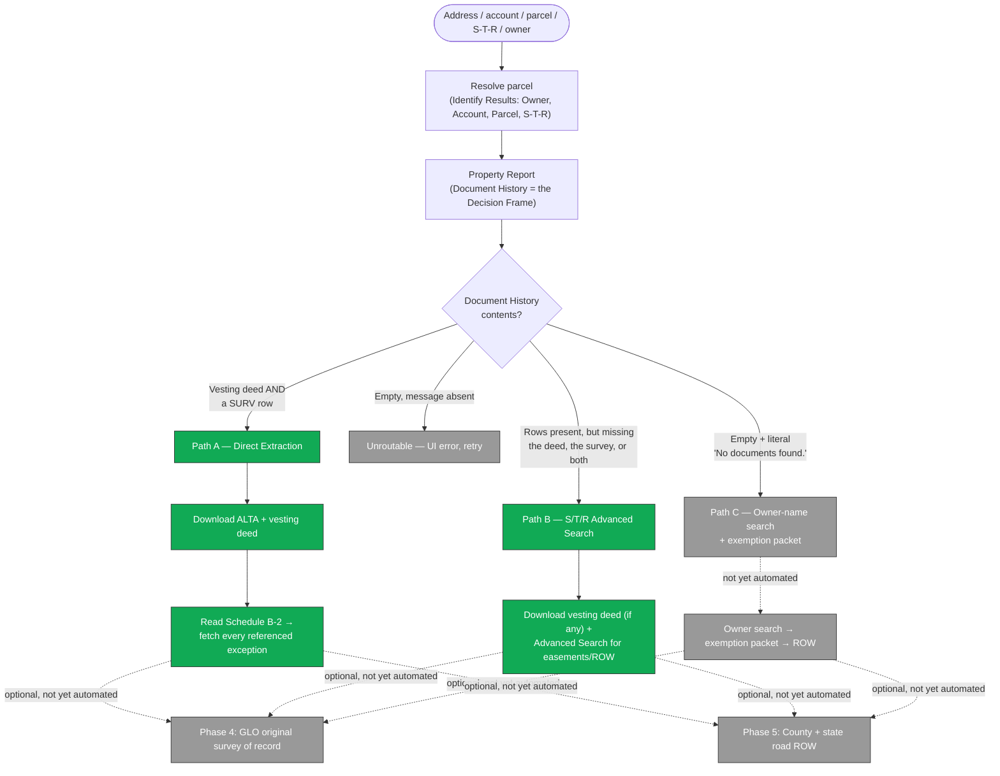

# Weld County SOP — ALTA / Exemption / Easement Extraction

This document is the source-of-truth specification for what
[`scrapers/weld_county.py`](../apps/worker/survey_art/scrapers/weld_county.py) should collect
and why. It's derived from a human-validated procedure written for a person (or an LLM
browser agent) clicking through Weld County's web portals by hand. Our scraper doesn't click
through anything for Phases 1–2 — it hits the same endpoints directly over HTTP — so this
doc describes the **decision logic and data**, not a literal click-by-click transcript. Where
the distinction matters, an **Implementation** callout explains what the code actually does.

The procedure has three research paths (A/B/C) that branch on what a parcel's Document
History contains, plus two supplemental phases (GLO original survey, road right-of-way) that
run independently of which path was taken. Today the scraper implements **Path A and Path
B**; Path C and both supplemental phases are documented here as the roadmap — see
[What's not yet automated](#whats-not-yet-automated).

---

## Inputs (variables the agent must resolve)

| Variable | Source | Notes |
|---|---|---|
| `{Subject_Property_Address}` | User input | Primary lookup — Priority 1. |
| `{APN_or_Account}` | Lookup result or direct input | Account format `Rxxxxxxx` (e.g. `R1611986`). Our CLI auto-detects `R\d{5,9}` or a 12-digit parcel ID and skips straight to the Property Report. |
| `{Section}`, `{Township}`, `{Range}` | Lookup result (PLSS) | E.g. `15`, `5N`, `67W`. Weld is entirely within the **6th Principal Meridian** — needed for GLO lookups (Phase 4). Some forms want zero-padded `01` or a numeric-only township/range — trial and error. |
| `{Owner_Name}` | Lookup result | Current record owner (individual or LLC). Fallback lookup key for Paths B and C. If Document History has no rows, try the owner's last name as **Grantee** in Advanced Search — that's what finds the vesting deed. |
| `{Client_Name}` | User input | Surveyor's client — not necessarily the property owner. Drives the SOP's output folder naming (not yet implemented, see roadmap). |
| `{Output_Folder}` | Derived | SOP layout: `Client Name → Project Name → Instruments → [Document Type]`. |

---

## Process flow / decision tree



Green = implemented today. Grey = documented, not yet automated.

---

## Parcel discovery & Property Report

The agent needs a **parcel match** before anything else. In priority order: address search
(preferred), Section/Township/Range, or owner name (last resort — ambiguous when an LLC
holds multiple parcels). A match yields an **Identify Results** panel: Owner, Account,
Parcel, Address, Subdivision, and S/T/R — persist all of it, since Paths B and C fall back
to it. From there, the **Property Report** (keyed by Account) renders Owner(s), **Document
History**, Building Info, Valuation, Tax Authorities, and a Map section. Document History is
the **Decision Frame** — everything downstream branches on its exact contents.

> **Implementation.** The scraper skips the browser walk entirely for this phase — it POSTs
> to `apps.weld.gov/propertyportal/index.cfm` for the parcel resolve, then GETs
> `propertyreport.weld.gov/?account=…` for the report. Every accordion section on that page is
> server-rendered in a single response (the "Open/Close All Sections" UI control is purely
> visual), so we parse all of them at once into `overview.json`. The literal browser walk
> through the GIS Hub tiles is still available via `--sop-strict` for demos.
>
> The **Map** section is captured separately: Playwright renders the iframe URL
> `https://maps.weld.gov/mapanaccount/?Account={Account}` and screenshots the result to
> `map.png`. See `_capture_map_image()` in
> [scrapers/weld_county.py](../apps/worker/survey_art/scrapers/weld_county.py).
>
> **Why we screenshot instead of embedding the live page.** `maps.weld.gov` sends response
> headers that block iframe embedding (`X-Frame-Options`/CSP `frame-ancestors`), so the web
> app's Map tab can't embed the live ESRI page directly. Playwright can still *navigate* to it
> (a top-level visit, not an embed, so it's unaffected) and screenshot the result. The worker
> uploads that screenshot to S3 (`maps/{jobId}.png`) and the web app renders it as a plain
> ``, with a "View on County Site" link to the live page. See `upload_map_image()` in
> `packages/survey_shared/survey_shared/jobs.py` and `_upload_map_image()` in
> `apps/worker/survey_art/worker.py`.
>
> **Timing matters.** The ESRI viewer resolves the account to a parcel extent, zooms, then
> renders the red selection-boundary layer — all after the base tiles paint. Screenshotting
> too early can catch multiple nearby parcels highlighted, or the whole-county default extent
> before it's zoomed in. `_capture_map_image()` waits for `networkidle`, then polls for an SVG
> `<path>` to appear (the selection layer), then an additional fixed delay before
> screenshotting — trim that delay carefully if you ever touch it. It also hides the ESRI zoom
> `+`/`−` widget via `page.evaluate()` right before the screenshot, since it's a fixed overlay,
> not map content.
>
> **A whole-county, unhighlighted image is not necessarily a capture bug.** If the account
> doesn't exist in Weld's parcel layer, the query returns zero features, the view never
> zooms, and the screenshot legitimately shows the same default extent the county's own site
> would show a human visiting that URL. Check the account number before assuming the capture
> is broken.
>
> **Note about URLs.** `propertyportal.weld.gov/propertyrptlist.aspx?account=...` and
> `propertyreport.weld.gov/?account=...` both serve the same Property Report data today
> (older vs. newer skin) — keep both as fallbacks.

---

## Decision Matrix

Evaluate Document History top-to-bottom and stop at the first matching condition.

| Letter | `overview.json` `path` | Condition | Route to |
|---|---|---|---|
| **A** | `direct` | Rows present, AND contains both a vesting deed AND at least one `SURV` row | **Path A** (Direct Extraction) |
| **B** | `alternate_partial` | Rows present, but missing the vesting deed, the `SURV` row, or both | **Path B** (S/T/R Advanced Search) |
| **C** | `alternate_empty` | No rows AND the literal string `No documents found.` is shown | **Path C** (owner-name search) |
| — | `unroutable` | No rows and that literal string is absent | UI rendering error — retry, do not route |

**Tie-breakers**
- If A and B both technically match, prefer A; fall through to B only if the ALTA
  verification step fails.
- If the table is still spinning after 15s, reload once and re-evaluate.
- **Never** route to C without the literal `No documents found.` text — a blank section from
  a UI error is a retry case, not Path C.

> **Implementation.** Wired as `_decision_matrix(records, html)` in
> [scrapers/weld_county.py](../apps/worker/survey_art/scrapers/weld_county.py). Vesting deed
> types are `{WD, WDN, SWD, SWDN, QCD, QCN, QCDN, GEN}` — the base set plus non-money variants
> seen in real data. `SURV` covers all surveys, including ALTAs. The decision is persisted to
> `overview.json` as `decision_matrix` (`path`, `sop_letter`, human-readable `reasoning`,
> matched rows, and the most-recent survey/deed) and `meta.sop_path` for downstream branching.

---

## Path A — Direct Extraction (happy path)

The ALTA is recorded against this parcel and referenced directly in Document History as a
`SURV` row.

The agent opens the most recent `SURV` row and verifies it before trusting it: the document
type should read `SURVEY` or `ALTA`, the recording date should be present, and Grantor/
Grantee/S-T-R should match the parcel. A mismatch means that `SURV` row belongs to an
unrelated easement survey — try the next-most-recent one, or fall through to Path B. Once
verified, download the ALTA and, separately, the most recent vesting deed (`WD`/`SWD`/`GEN`).
Then read the ALTA's **Schedule B-2** for every reception number it cites — these are
easements, ROW grants, and prior deeds burdening the parcel that don't appear in the
parcel's own Document History — and fetch each one too.

> **Implementation.** Wired as `_select_phase_3a_targets()` + `_download_documents()`,
> gated on `decision_matrix.path == "direct"`. Files land at
> `tmp/{county}/{account}/{role}_{reception}.pdf` (or `_p{n}.pdf` per page for multi-page
> docs).
>
> **Disclaimer + reCAPTCHA bypass.** The disclaimer page at `recording.weld.gov` has a
> reCAPTCHA-gated "I Accept" button that headless Chromium can't pass. We inject the
> `disclaimerAccepted=true` cookie directly into the Playwright context — the document viewer
> only checks for that cookie's presence.
>
> **Login.** Anonymous viewing on `recording.weld.gov` returns a "must be a registered user"
> stub instead of document images, so we POST credentials directly to `/web/user/login` via
> `ctx.request.post()` (the in-page button is a jQuery Mobile fragment whose handler doesn't
> fire under Playwright). Set `WELD_RECORDER_USERNAME` / `WELD_RECORDER_PASSWORD` in `.env`.
> Register for free at `https://recording.weld.gov/web/user/register` if needed. **Never
> re-login mid-run** once a session is already valid — it poisons the disclaimer cookie and
> silently fails every fetch after it (see the retry-loop comment in `_download_documents()`).
>
> **The Schedule B-2 exception walk is implemented** by
> [`id_extraction.py`](../apps/worker/survey_art/id_extraction.py) (`extract_document_ids()`,
> called "Step 3A.5" elsewhere in this codebase — you'll see that name in `README.md` and
> code comments). Tyler's ALTAs are scanned images with no text layer, so extraction falls
> through to Bedrock, which reads each sheet as overlapping tiles. Every ID found — fetchable
> or not — lands in `overview.json` under `extracted_ids`; each `reception_number` is then
> fetched through the same integration URL the ALTA itself came from. `APPLICATION_MODE=demo`
> caps how many get *downloaded* (not recorded) so a demo doesn't wait out a ~90-document
> ALTA. See [`README.md`](../README.md#reading-the-alta-step-3a5) for measured accuracy.

---

## Path B — Advanced Search (rows present, but missing survey or deed)

The ALTA was either delivered out-of-band or never recorded. The agent downloads whatever
vesting deed exists, then reconstructs the easement/ROW packet by searching the recorder's
Advanced Search on the parcel's Section/Township/Range with a document-type filter:

```
EASEMENT, EASEMENT & RIGHT OF WAY, EASEMENT DEED, EASEMENT PLAT,
EASEMENT RIGHT OF WAY & SURFACE USE AGR, GRANT & RELEASE OF EASEMENT,
RIGHT OF WAY EASEMENT, R/W AGREEMENT, ROW, RIGHT OF WAY,
RIGHT OF WAY AGREEMENT, AMENDED RIGHT OF WAY,
EASEMENT RIGHT OF WAY AND SURFACE USE AGR, EASEMENT & SURFACE USE AGR,
RIGHT OF WAY (RW)
```

If the parcel belongs to a named subdivision, repeat the search filtered on **Platted
Legal — Subdivision** instead of raw S/T/R, and de-duplicate against the first pass by
reception number. If a client-supplied ALTA already exists locally, reconcile its Schedule
B-2 against what Advanced Search turned up rather than treating it as missing.

> **Implementation.** Wired as `_select_phase_3b_targets()` + `_run_advanced_search()`,
> gated on `decision_matrix.path == "alternate_partial"`. Two passes:
>
> 1. Most-recent vesting deed (if Document History has one) — downloaded the same way Path A
>    grabs documents.
> 2. Advanced Search at `/web/search/DOCSEARCH524S12`. The form's direct HTTP POST endpoint
>    (`/web/searchPost/...`) returns metadata only, so we drive the actual page UI via
>    Playwright instead. Results come from `li.ss-search-row` elements
>    (`data-documentid` + a header carrying `<reception> • <type> • <date>`). **Authentication
>    is required here** — Advanced Search returns no rows for anonymous sessions, unlike the
>    document viewer itself.
> 3. If `parcel.subdivision` is non-empty, a second Advanced Search runs with
>    `Platted Legal → Subdivision`, deduplicated against the S/T/R pass by reception number.
>
> The Document Types field above is an autocomplete widget that's awkward to drive
> headlessly, so we post-filter result rows in Python (`_PHASE_3B_DOC_TYPES`) instead: any row
> whose Type contains `EASEMENT`, `RIGHT OF WAY`, `R/W`, or `ROW` is kept.
>
> **Not implemented:** cross-reference harvesting from the vesting deed's legal description
> (the "Excluding those portions conveyed in Deed recorded …" clauses that cite prior
> receptions). Tyler PDFs are scanned images with no text layer, so this would need OCR or a
> vision LLM. The S/T/R Advanced Search above already finds most easements in the same
> section independently, so the practical recall loss is small.

---

## Path C — Owner-name search + exemption packet

*Not yet automated — documented here as the target behavior.*

Typical for large legacy agricultural parcels recorded against the parent owner across
multiple sections rather than per-account, so Document History for this specific account is
empty. The agent has to drive everything from the recorder's search using `{Owner_Name}` and
S/T/R instead: search by owner as Grantor/Grantee, open the results whose Legal column
matches the section (paying particular attention to affidavits and quit-claim deeds, which
tend to carry the Exhibit A listing every contiguous parcel the owner holds), then harvest
every S/T/R referenced there as the search universe for two more Advanced Search passes —
one filtered to subdivision-exemption document types, one to the same easement/ROW filter
list Path B uses. If a last-ditch survey-type search still finds nothing, the exemption
packet itself becomes the de facto survey of record.

Today the scraper simply stops when it hits this branch (`decision_matrix.path ==
"alternate_empty"`), logging that the path isn't implemented — see the `else` branch in
`scrape()`.

---

## Phase 4 — GLO original survey of record

*Not yet automated.* Retrieves the original U.S. cadastral survey for the parcel's
Section/Township/Range: the BLM General Land Office (GLO) township survey plat, its field
notes, and any federal land patent(s) — the earliest authoritative documents fixing the
original section corners, monuments, and meander lines that every later ALTA ties back to.
Especially valuable when Path C fires (legacy agricultural parcels) or when an ALTA's
basis-of-bearings cites the original PLSS survey. Weld County sits entirely within the
**6th Principal Meridian**, which the GLO index requires alongside Township and Range.

The lookup is at `glorecords.blm.gov` → **Search Documents** → **Search Documents By
Type**, filtered to State = Colorado, County = Weld, and the parcel's Township/Range/
Meridian. The `Surveys` category returns the original township plat and links to its field
notes; the `Patents` category (optional) returns the original federal land patent, searchable
by the same location plus the original patentee's name.

This overlaps with the "BLM GLO Records" row already tracked in the repo-wide supplemental
sources table (see [`AGENTS.md`](../AGENTS.md#statewide--supplemental-sources-not-yet-integrated))
— that table is the general statewide entry point; this section is what a Weld-specific
integration would actually search on.

---

## Phase 5 — County & state road right-of-way

*Not yet automated.* Assembles the road ROW packet a title commitment's Schedule B-2 usually
just cites by reception/date rather than attaches: both county roads (established or vacated
by the Weld County Board of County Commissioners) and state highways (CDOT). Two sources:

- **County roads** — Weld's BOCC minutes and resolutions live in a Laserfiche WebLink
  (`minutes.weld.gov/WebLink/`), searchable by date or by the Section/Township/Range recorded
  in each entry's properties panel. Road petitions, viewers' reports, and vacation
  resolutions show up here; some cite a Book/Page that's then pullable from the recorder
  directly.
- **State highways** — CDOT's Online Transportation Information System (OTIS,
  `dtdapps.codot.gov/otis`) → **Highway Data Explorer** → search by county + route number +
  milepost range → **Documents** tab → **ROW Plans**. Plan sets include a
  "R.O.W. Tabulation of Properties" sheet listing parcels by owner/location/easement type.

**Implementation note for whoever picks this up:** Schedule B-2 reception numbers for road
ROW exceptions are already being extracted in Path A's exception walk (`extracted_ids` in
`overview.json`) — Phase 5 mostly needs the *county-road and CDOT plan-sheet* lookups that
aren't reachable by reception number at all, not a second pass over what Path A already
found.

---

## Document Type Cheat Sheet

The Property Report's Document History uses short codes; the recorder's Advanced Search uses
full names.

| Property Report code | Document Type | Advanced Search filter value(s) |
|---|---|---|
| `SURV` | Survey (incl. ALTA Land Title Survey) | `SURVEY`, `ALTA SURVEY`, `AMENDED SURVEY` |
| `WD` | Warranty Deed | `WARRANTY DEED` |
| `SWD` | Special Warranty Deed | `SPECIAL WARRANTY DEED` |
| `QCD` | Quit Claim Deed | `QUIT CLAIM DEED` |
| `GEN` | General Warranty Deed | `GENERAL WARRANTY DEED` |
| `EXC` | Exception (Mineral / Surface) | `EXCEPTION`, `RESERVATION` |
| `USR` | Use by Special Review | `USE BY SPECIAL REVIEW` |
| `EASE` | Easement | `EASEMENT`, `EASEMENT DEED`, `EASEMENT PLAT` |
| `ROW` | Right of Way | `RIGHT OF WAY`, `RIGHT OF WAY EASEMENT`, `R/W AGREEMENT`, `AMENDED RIGHT OF WAY` |
| `SUBX` / `EXEMPT` | Subdivision Exemption | `SUBDIVISION EXEMPTION`, `EXEMPTION`, `MINOR SUBDIVISION`, `AMENDED EXEMPTION` |
| `AFF` | Affidavit | `AFFIDAVIT` |
| `NOV` / `NOD` | Notice of Valuation / Decision | `NOTICE OF VALUATION`, `NOTICE OF DECISION` |

`_SURVEY_TYPE_CODES` in
[`weld_county.py`](../apps/worker/survey_art/scrapers/weld_county.py) covers most of these —
keep that set as the source of truth for which document types survive filtering.

---

## URL Reference

| Purpose | URL |
|---|---|
| Property Report (older skin) | `https://propertyportal.weld.gov/propertyrptlist.aspx?account={Account}` |
| Property Report (current scraper form) | `https://propertyreport.weld.gov/?account={Account}` |
| Property Portal map | `https://maps.weld.gov/propertyportal/` |
| Recorder — document viewer | `https://recording.tylerhost.net/web/document/{ReceptionId}` |
| Recorder — Advanced Search | `https://recording.tylerhost.net/Search/Advanced` |
| Recorder mirror (used in code) | `https://recording.weld.gov/web/web/integration/document/{ReceptionId}` |
| BLM GLO Records (Phase 4) | `https://glorecords.blm.gov/default.aspx` |
| Weld BOCC minutes / Laserfiche (Phase 5) | `https://minutes.weld.gov/WebLink/` |
| CDOT OTIS — Highway Data Explorer (Phase 5) | `https://dtdapps.codot.gov/otis/HighwayData` |

> **Anonymous access.** The SOP states registration is only required to purchase certified
> copies — anonymous viewing should be sufficient for ALTA/exemption/easement documents on
> `recording.tylerhost.net`. Today's scraper always logs in via the `recording.weld.gov`
> mirror regardless. Worth A/B-testing whether that mirror actually requires auth or the code
> is just being conservative — see [What's not yet automated](#whats-not-yet-automated).

---

## Worked Example — R1611986 (Stratus Delantero LLC)

| Field | Value |
|---|---|
| Account | `R1611986` |
| Parcel | `095715000012` |
| Owner | `STRATUS DELANTERO LLC` |
| Section / Township / Range | `15 / 5N / 67W` (6th P.M.) |
| Legal | `GR 22S72 E2 15 S 67 (GOLD HILL #1 & #2 ANNEX) EXC UPRR RES (166)` |
| Vesting Reception | `4970002` |

Document History (filtered to survey-relevant types) returns 4 documents: `WD (1999)`,
`QCN (2008)`, `SURV (2020)`, `SWD (2024)`. Path A applies. Expected outputs:
`{role}_4970002.pdf` (2024 SWD vesting deed) and the 2020 `SURV` row as the ALTA, plus one
`exception_<reception>.pdf` per Schedule B-2 reference. This is the same parcel a Phase 4/5
integration would search GLO Township 5N Range 67W and Weld's road-ROW sources against.

---

## Failure-Mode Quick Reference

| Failure | Recovery |
|---|---|
| Property Portal map fails to render | Hard refresh; confirm WebGL; fall back to the PDF Maps tile and supply the parcel manually. |
| Identify Results shows multiple parcels (e.g. split by an easement) | Process each parcel separately — independent runs. |
| Recorder prompts for login | Anonymous viewing is documented as sufficient — click Cancel and continue if it's just a viewing gate. |
| Schedule B-2 reception returns no result | Likely recorded in a different county or pre-1893; log and continue, don't block the run. |
| Document History expands but stays blank without `No documents found.` | UI error — reload once and retry. Do **not** treat as Path C. |

---

## What's not yet automated

1. **Path C** (owner-name search + exemption packet) — the scraper stops as soon as
   `decision_matrix.path == "alternate_empty"`; no owner-name search or subdivision-exemption
   Advanced Search is driven.
2. **Phase 4** (GLO survey of record) — no `glorecords.blm.gov` integration exists.
3. **Phase 5** (road right-of-way) — no BOCC Laserfiche or CDOT OTIS integration exists.
4. **Exhibit A cross-reference parsing** (Path B) — prior-deed reception numbers cited inside
   a vesting deed's legal description aren't extracted; would need OCR or a vision LLM since
   Tyler PDFs are scanned images.
5. **Output naming/folder structure** — today's files are `{role}_{reception}.pdf` under a
   flat `tmp/{county}/{account}/`. The `Client → Project → Instruments → [Document Type]`
   hierarchy is a UI/export concern, not something the scraper itself builds.
6. **Anonymous vs. authenticated recorder access** — see the URL Reference note above.

These are the natural next slices for extending Weld coverage.
