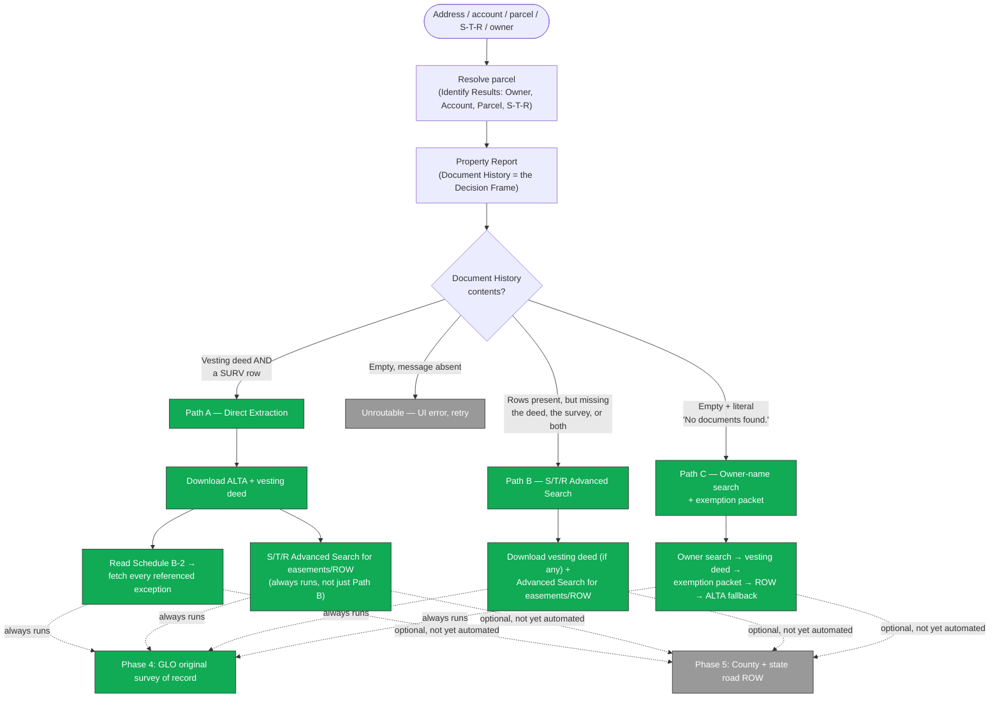

# Weld County SOP — ALTA / Exemption / Easement Extraction

This document is the source-of-truth specification for what
[`scrapers/weld_county.py`](../apps/worker/survey_art/scrapers/weld_county.py) should collect
and why. It's derived from a human-validated procedure written for a person (or an LLM
browser agent) clicking through Weld County's web portals by hand. Our scraper doesn't click
through anything for Phases 1–2 — it hits the same endpoints directly over HTTP — so this
doc describes the **decision logic and data**, not a literal click-by-click transcript. Where
the distinction matters, an **Implementation** callout explains what the code actually does.

The procedure has three research paths (A/B/C) that branch on what a parcel's Document
History contains, plus two supplemental phases (GLO original survey, road right-of-way) that
run independently of which path was taken. Today the scraper implements **all three paths**.
The S/T/R easement/ROW Advanced Search (Phase 3B's core search) is not exclusive to Path
B — it runs unconditionally alongside whichever path fires, since a recorded ALTA's
Schedule B-2 only lists what its surveyor happened to cite, not necessarily everything else
recorded against the section. The two supplemental phases (GLO, road ROW) are documented
here as the roadmap — see [What's not yet automated](#whats-not-yet-automated).

---

## Inputs (variables the agent must resolve)

| Variable | Source | Notes |
|---|---|---|
| `{Subject_Property_Address}` | User input | Primary lookup — Priority 1. |
| `{APN_or_Account}` | Lookup result or direct input | Account format `Rxxxxxxx` (e.g. `R1611986`). Our CLI auto-detects `R\d{5,9}` or a 12-digit parcel ID and skips straight to the Property Report. |
| `{Section}`, `{Township}`, `{Range}` | Lookup result (PLSS) | E.g. `15`, `5N`, `67W`. Weld is entirely within the **6th Principal Meridian** — needed for GLO lookups (Phase 4). Some forms want zero-padded `01` or a numeric-only township/range — trial and error. |
| `{Owner_Name}` | Lookup result | Current record owner (individual or LLC). Fallback lookup key for Paths B and C. If Document History has no rows, try the owner's last name as **Grantee** in Advanced Search — that's what finds the vesting deed. |
| `{Client_Name}` | User input | Surveyor's client — not necessarily the property owner. Drives the SOP's output folder naming (not yet implemented, see roadmap). |
| `{Output_Folder}` | Derived | SOP layout: `Client Name → Project Name → Instruments → [Document Type]`. |

---

## Process flow / decision tree


```mermaid
flowchart TD
    Start(["Address / account / parcel / S-T-R / owner"]) --> Resolve["Resolve parcel\n(Identify Results: Owner, Account, Parcel, S-T-R)"]
    Resolve --> Report["Property Report\n(Document History = the Decision Frame)"]
    Report --> Decide{"Document History\ncontents?"}

    Decide -->|"Vesting deed AND\na SURV row"| PathA["Path A — Direct Extraction"]
    Decide -->|"Rows present, but missing\nthe deed, the survey, or both"| PathB["Path B — S/T/R Advanced Search"]
    Decide -->|"Empty + literal\n'No documents found.'"| PathC["Path C — Owner-name search\n+ exemption packet"]
    Decide -->|"Empty, message absent"| Retry["Unroutable — UI error, retry"]

    PathA --> ALTA["Download ALTA + vesting deed"]
    ALTA --> Sched["Read Schedule B-2 →\nfetch every referenced exception"]
    ALTA --> Adv["S/T/R Advanced Search for easements/ROW\n(always runs, not just Path B)"]

    PathB --> Adv2["Download vesting deed (if any) +\nAdvanced Search for easements/ROW"]

    PathC --> Own["Owner search → vesting deed →\nexemption packet → ROW → ALTA fallback"]

    Sched -.always runs.-> P4["Phase 4: GLO original survey of record"]
    Adv -.always runs.-> P4
    Adv2 -.always runs.-> P4
    Own -.always runs.-> P4
    Sched -.optional, not yet automated.-> P5["Phase 5: County + state road ROW"]
    Adv -.optional, not yet automated.-> P5
    Adv2 -.optional, not yet automated.-> P5
    Own -.optional, not yet automated.-> P5

    classDef implemented fill:#1a5,stroke:#333,color:#fff
    classDef pending fill:#999,stroke:#333,color:#fff
    class PathA,ALTA,Sched,Adv,PathB,Adv2,PathC,Own,P4 implemented
    class Retry,P5 pending
```

Green = implemented today. Grey = documented, not yet automated.

---

## Parcel discovery & Property Report

The agent needs a **parcel match** before anything else. In priority order: address search
(preferred), Section/Township/Range, or owner name (last resort — ambiguous when an LLC
holds multiple parcels). A match yields an **Identify Results** panel: Owner, Account,
Parcel, Address, Subdivision, and S/T/R — persist all of it, since Paths B and C fall back
to it. From there, the **Property Report** (keyed by Account) renders Owner(s), **Document
History**, Building Info, Valuation, Tax Authorities, and a Map section. Document History is
the **Decision Frame** — everything downstream branches on its exact contents.

> **Implementation.** The scraper skips the browser walk entirely for this phase — it POSTs
> to `apps.weld.gov/propertyportal/index.cfm` for the parcel resolve, then GETs
> `propertyreport.weld.gov/?account=…` for the report. Every accordion section on that page is
> server-rendered in a single response (the "Open/Close All Sections" UI control is purely
> visual), so we parse all of them at once into `overview.json`. The literal browser walk
> through the GIS Hub tiles is still available via `--sop-strict` for demos.
>
> The **Map** section is captured separately: Playwright renders the iframe URL
> `https://maps.weld.gov/mapanaccount/?Account={Account}` and screenshots the result to
> `map.png`. See `_capture_map_image()` in
> [scrapers/weld_county.py](../apps/worker/survey_art/scrapers/weld_county.py).
>
> **Why we screenshot instead of embedding the live page.** `maps.weld.gov` sends response
> headers that block iframe embedding (`X-Frame-Options`/CSP `frame-ancestors`), so the web
> app's Map tab can't embed the live ESRI page directly. Playwright can still *navigate* to it
> (a top-level visit, not an embed, so it's unaffected) and screenshot the result. The worker
> uploads that screenshot to S3 (`maps/{jobId}.png`) and the web app renders it as a plain
> ``, with a "View on County Site" link to the live page. See `upload_map_image()` in
> `packages/survey_shared/survey_shared/jobs.py` and `_upload_map_image()` in
> `apps/worker/survey_art/worker.py`.
>
> **Timing matters.** The ESRI viewer resolves the account to a parcel extent, zooms, then
> renders the red selection-boundary layer — all after the base tiles paint. Screenshotting
> too early can catch multiple nearby parcels highlighted, or the whole-county default extent
> before it's zoomed in. `_capture_map_image()` waits for `networkidle`, then polls for an SVG
> `<path>` to appear (the selection layer), then an additional fixed delay before
> screenshotting — trim that delay carefully if you ever touch it. It also hides the ESRI zoom
> `+`/`−` widget via `page.evaluate()` right before the screenshot, since it's a fixed overlay,
> not map content.
>
> **A whole-county, unhighlighted image is not necessarily a capture bug.** If the account
> doesn't exist in Weld's parcel layer, the query returns zero features, the view never
> zooms, and the screenshot legitimately shows the same default extent the county's own site
> would show a human visiting that URL. Check the account number before assuming the capture
> is broken.
>
> **Note about URLs.** `propertyportal.weld.gov/propertyrptlist.aspx?account=...` and
> `propertyreport.weld.gov/?account=...` both serve the same Property Report data today
> (older vs. newer skin) — keep both as fallbacks.

---

## Decision Matrix

Evaluate Document History top-to-bottom and stop at the first matching condition.

| Letter | `overview.json` `path` | Condition | Route to |
|---|---|---|---|
| **A** | `direct` | Rows present, AND contains both a vesting deed AND at least one `SURV` row | **Path A** (Direct Extraction) |
| **B** | `alternate_partial` | Rows present, but missing the vesting deed, the `SURV` row, or both | **Path B** (S/T/R Advanced Search) |
| **C** | `alternate_empty` | No rows AND the literal string `No documents found.` is shown | **Path C** (owner-name search) |
| — | `unroutable` | No rows and that literal string is absent | UI rendering error — retry, do not route |

**Tie-breakers**
- If A and B both technically match, prefer A; fall through to B only if the ALTA
  verification step fails.
- If the table is still spinning after 15s, reload once and re-evaluate.
- **Never** route to C without the literal `No documents found.` text — a blank section from
  a UI error is a retry case, not Path C.

> **Implementation.** Wired as `_decision_matrix(records, html)` in
> [scrapers/weld_county.py](../apps/worker/survey_art/scrapers/weld_county.py). Vesting deed
> types are `{WD, WDN, SWD, SWDN, QCD, QCN, QCDN, GEN}` — the base set plus non-money variants
> seen in real data. `SURV` covers all surveys, including ALTAs. The decision is persisted to
> `overview.json` as `decision_matrix` (`path`, `sop_letter`, human-readable `reasoning`,
> matched rows, and the most-recent survey/deed) and `meta.sop_path` for downstream branching.

---

## Path A — Direct Extraction (happy path)

The ALTA is recorded against this parcel and referenced directly in Document History as a
`SURV` row.

The agent opens the most recent `SURV` row and verifies it before trusting it: the document
type should read `SURVEY` or `ALTA`, the recording date should be present, and Grantor/
Grantee/S-T-R should match the parcel. A mismatch means that `SURV` row belongs to an
unrelated easement survey — try the next-most-recent one, or fall through to Path B. Once
verified, download the ALTA and, separately, the most recent vesting deed (`WD`/`SWD`/`GEN`).
Then read the ALTA's **Schedule B-2** for every reception number it cites — these are
easements, ROW grants, and prior deeds burdening the parcel that don't appear in the
parcel's own Document History — and fetch each one too.

> **Implementation.** Wired as `_select_direct_extraction_targets()` + `_download_documents()`,
> gated on `decision_matrix.path == "direct"`. Files land at
> `tmp/{county}/{account}/{role}_{reception}.pdf` (or `_p{n}.pdf` per page for multi-page
> docs).
>
> **Disclaimer + reCAPTCHA bypass.** The disclaimer page at `recording.weld.gov` has a
> reCAPTCHA-gated "I Accept" button that headless Chromium can't pass. We inject the
> `disclaimerAccepted=true` cookie directly into the Playwright context — the document viewer
> only checks for that cookie's presence.
>
> **Login.** Anonymous viewing on `recording.weld.gov` returns a "must be a registered user"
> stub instead of document images, so we POST credentials directly to `/web/user/login` via
> `ctx.request.post()` (the in-page button is a jQuery Mobile fragment whose handler doesn't
> fire under Playwright). Set `WELD_RECORDER_USERNAME` / `WELD_RECORDER_PASSWORD` in `.env`.
> Register for free at `https://recording.weld.gov/web/user/register` if needed. **Never
> re-login mid-run** once a session is already valid — it poisons the disclaimer cookie and
> silently fails every fetch after it (see the retry-loop comment in `_download_documents()`).
>
> **The Schedule B-2 exception walk is implemented** by
> [`id_extraction.py`](../apps/worker/survey_art/id_extraction.py) (`extract_document_ids()`)
> and turned into download targets by `_select_schedule_b2_exception_targets()`. Tyler's
> ALTAs are scanned images with no text layer, so extraction falls through to Bedrock, which
> reads each sheet as overlapping tiles. Every ID found — fetchable or not — lands in
> `overview.json` under `extracted_ids`; each `reception_number` is then fetched through the
> same integration URL the ALTA itself came from. `APPLICATION_MODE=demo` caps how many get
> *downloaded* (not recorded) so a demo doesn't wait out a ~90-document ALTA. See
> [`README.md`](../README.md#reading-the-alta-schedule-b-2) for measured accuracy.
>
> **This isn't ALTA-only.** `_expand_cross_references()` in `scrapers/weld_county.py` runs
> this same extraction over *every* document the scraper downloads, for every routing path
> — an easement or vesting deed can cite its own prior documents just as easily as an ALTA
> can. It fetches newly-cited documents and reads those too, recursively, until nothing new
> turns up. Two sets keep this bounded and non-redundant: `known_receptions` (never
> downloads the same reception twice) and an internal `extracted` set (never runs
> `extract_document_ids()` — and its Bedrock fallback — on the same document twice, even if
> two different documents both cite it). `_MAX_CROSS_REFERENCE_DOCS` is a cost/runtime
> backstop, not a correctness requirement — the underlying document graph is finite.

---

## Path B — Advanced Search (rows present, but missing survey or deed)

The ALTA was either delivered out-of-band or never recorded. The agent downloads whatever
vesting deed exists, then reconstructs the easement/ROW packet by searching the recorder's
Advanced Search on the parcel's Section/Township/Range with a document-type filter:

```
EASEMENT, EASEMENT & RIGHT OF WAY, EASEMENT DEED, EASEMENT PLAT,
EASEMENT RIGHT OF WAY & SURFACE USE AGR, GRANT & RELEASE OF EASEMENT,
RIGHT OF WAY EASEMENT, R/W AGREEMENT, ROW, RIGHT OF WAY,
RIGHT OF WAY AGREEMENT, AMENDED RIGHT OF WAY,
EASEMENT RIGHT OF WAY AND SURFACE USE AGR, EASEMENT & SURFACE USE AGR,
RIGHT OF WAY (RW)
```

If the parcel belongs to a named subdivision, repeat the search filtered on **Platted
Legal — Subdivision** instead of raw S/T/R, and de-duplicate against the first pass by
reception number. If a client-supplied ALTA already exists locally, reconcile its Schedule
B-2 against what Advanced Search turned up rather than treating it as missing.

> **Implementation.** Wired as `_select_partial_history_targets()` + `_run_advanced_search()`,
> gated on `decision_matrix.path == "alternate_partial"`. Two passes:
>
> 1. Most-recent vesting deed (if Document History has one) — downloaded the same way Path A
>    grabs documents.
> 2. Advanced Search at `/web/search/DOCSEARCH524S12`. The form's direct HTTP POST endpoint
>    (`/web/searchPost/...`) returns metadata only, so we drive the actual page UI via
>    Playwright instead. Results come from `li.ss-search-row` elements
>    (`data-documentid` + a header carrying `<reception> • <type> • <date>`). **Authentication
>    is required here** — Advanced Search returns no rows for anonymous sessions, unlike the
>    document viewer itself.
> 3. If `parcel.subdivision` is non-empty, a second Advanced Search runs with
>    `Platted Legal → Subdivision`, deduplicated against the S/T/R pass by reception number.
>
> The Document Types field above is an autocomplete widget that's awkward to drive
> headlessly, so we post-filter result rows in Python (`_EASEMENT_ROW_DOC_TYPES`) instead:
> any row whose Type contains `EASEMENT`, `RIGHT OF WAY`, `R/W`, or `ROW` is kept.
>
> **This S/T/R easement/ROW scan is not exclusive to Path B.** It's factored out as
> `_easement_row_search()` and also runs unconditionally when direct extraction fires — see
> `scrape()`'s supplemental block after the Schedule B-2 exception walk. An ALTA's Schedule
> B-2 only lists what its surveyor happened to cite, not necessarily everything else recorded
> against the section, so the SOP treats this research as required regardless of routing.
>
> **Not implemented:** cross-reference harvesting from the vesting deed's legal description
> (the "Excluding those portions conveyed in Deed recorded …" clauses that cite prior
> receptions). Tyler PDFs are scanned images with no text layer, so this would need OCR or a
> vision LLM. The S/T/R Advanced Search above already finds most easements in the same
> section independently, so the practical recall loss is small.

---

## Path C — Owner-name search + exemption packet

Typical for large legacy agricultural parcels recorded against the parent owner across
multiple sections rather than per-account, so Document History for this specific account is
empty. The agent has to drive everything from the recorder's search using `{Owner_Name}` and
S/T/R instead: search by owner as Grantor/Grantee, open the results whose Legal column
matches the section (paying particular attention to affidavits and quit-claim deeds, which
tend to carry the Exhibit A listing every contiguous parcel the owner holds), then harvest
every S/T/R referenced there as the search universe for two more Advanced Search passes —
one filtered to subdivision-exemption document types, one to the same easement/ROW filter
list Path B uses. If a last-ditch survey-type search still finds nothing, the exemption
packet itself becomes the de facto survey of record.

> **Implementation.** Wired as `_select_owner_name_search_targets()`, gated on
> `decision_matrix.path == "alternate_empty"`. Runs against the same authenticated Advanced
> Search session as Path B (`_recorder_search_session()`), in order:
>
> 1. **Owner-name search** — `_run_advanced_search(page, search_name=owner)`
>    fills `#field_BothNamesID` ("Search Name as Grantor or Grantee") on the same Advanced
>    Search form Path B uses; there's no separate Basic Search page to drive. The most recent
>    row matching a vesting-deed label (`WARRANTY DEED` / `SPECIAL WARRANTY DEED` /
>    `QUIT CLAIM DEED` / `GENERAL WARRANTY DEED`) becomes the `vesting_deed` target; any
>    `AFFIDAVIT` rows are downloaded too, per the SOP's Exhibit A note.
> 2. **Subdivision Exemption search** — S/T/R only, post-filtered in Python
>    (`_matches_exemption_filter`) against `SUBDIVISION EXEMPTION`, `EXEMPTION`,
>    `MINOR SUBDIVISION`, `AMENDED EXEMPTION`.
> 3. **Easement/ROW scan** — the same `_easement_row_search()` Path B uses.
> 4. **ALTA fallback search** — S/T/R only, post-filtered for a `SURVEY`/`ALTA`
>    doc type not already targeted. If nothing matches, logs
>    "No recorded ALTA was found — the exemption packet is the survey of record."
>
> **Not implemented:** the Exhibit A cross-reference harvest (extra S/T/R values
> cited in a quit-claim deed) — same reason Path B skips it: Tyler PDFs are scanned images
> with no text layer. The search universe falls back to the parcel's own Identify Results
> S/T/R instead of whatever the deed's Exhibit A would add.

---

## Full section/township/range document scan

After whichever research route above finishes (and after cross-reference expansion), the
scraper runs one more unfiltered Advanced Search — same S/T/R fields as the easement/ROW
scan, but **no doc-type post-filter** — to catch anything else recorded against this
parcel's section that neither Document History nor cross-reference harvesting turned up.
Anything found and not already downloaded this run gets pulled too.

> **Implementation.** `_section_township_range_search()`, called unconditionally at the end
> of `scrape()` regardless of routing path. Deduplicates against the run's whole
> `known_receptions` set (already includes everything from direct extraction, the
> easement/ROW scan, and cross-reference expansion), so nothing already on disk is
> re-downloaded. Results land in `overview.json` under `section_township_range_search`,
> separate from the route's own results section, so a surveyor can see at a glance which
> documents were targeted directly versus turned up by this broader sweep.

### Book/Page citations and the pre-1994 gap

The recorder only indexed legal descriptions (Section/Township/Range) from about **1994**
on. A section search can't see anything older: S15-T5N-R67W returns 82 documents, two from
1908-1912 and the rest 1994+. Older deeds, road rights-of-way and railroad reservations are
reachable only by **reception number** or **Book/Page**, which is how an ALTA cites them.

The Advanced Search form has Book and Page fields (`#field_BookPageID_DOT_Book` /
`_Page`), and `_resolve_book_page_citations()` uses them for every `book_page` id the
cross-reference walk extracts. **Book numbers repeat across eras**, so a hit is only
accepted when its recording year matches a year printed in the citation — Book 1583 Page
294 is cited as a 1961 highway deed and the recorder's hit is a 1996 deed of trust. A
citation with no year, or no year-matched hit, is left in `extracted_ids` for a manual pull.
Of R1611986's 8 Book/Page citations: 2 resolved (1889 Book 86/273, 1908 Book 233/185), 2
rejected as the wrong era, 2 not in the index at all (1916, 1934), 2 with no year.
Resolutions are recorded in `overview.json` → `book_page_resolutions`.

---

## Phase 4 — GLO original survey of record

Retrieves the original U.S. cadastral survey for the parcel's Section/Township/Range: the
BLM General Land Office (GLO) township survey plat, its field notes, and any federal land
patent(s) — the earliest authoritative documents fixing the original section corners,
monuments, and meander lines that every later ALTA ties back to. Especially valuable when
Path C fires (legacy agricultural parcels) or when an ALTA's basis-of-bearings cites the
original PLSS survey. Weld County sits entirely within the **6th Principal Meridian**, which
the GLO index requires alongside Township and Range.

The lookup is at `glorecords.blm.gov` → **Search Documents** → **Search Documents By
Type**, filtered to State = Colorado, County = Weld, and the parcel's Township/Range/
Meridian. The `Surveys` category returns the original township plat and links to its field
notes; the `Patents` category (optional) returns the original federal land patent, searchable
by the same location plus the original patentee's name.

This overlaps with the "BLM GLO Records" row already tracked in the repo-wide supplemental
sources table (see [`AGENTS.md`](../AGENTS.md#statewide--supplemental-sources-not-yet-integrated))
— that table is the general statewide entry point; this section is what a Weld-specific
integration would actually search on.

> **Implementation.** `scrapers/glo_records.py`'s `fetch_glo_records()`, called
> unconditionally near the end of `scrape()` whenever `ParcelInfo` has a Township and Range —
> it doesn't depend on which Decision Matrix route fired. Unlike the rest of this file,
> `glorecords.blm.gov` has no address or reception-number search and its results are dynamic
> ASP.NET controls rather than deep-linkable URLs, so this goes through a `browser-use` LLM
> agent (the same approach as `scrapers/denver_county.py`) instead of direct HTTP. Results
> land in `overview.json` under `glo_records`; downloaded files are classified by filename
> keyword (`fieldnote`/`patent`/else-survey-plat) into the `documents` table since the GLO
> site has no reception number to key off of. The `Patents` search is best-effort — an empty
> result isn't treated as a failure, since most parcels have no indexed federal patent.

---

## Phase 5 — County & state road right-of-way

Assembles the complete road right-of-way (ROW) packet for the parcel: county roads
(established or vacated by the Weld County Board of County Commissioners, "BOCC") and
state highways (Colorado Department of Transportation, "CDOT"). The ALTA / title
commitment's Schedule B-2 lists these ROWs as exceptions; this phase pulls the underlying
recorded instruments and the governing plan sheets. Run it after the vesting deed / ALTA
is in hand (Paths A–C). Source: the "State and County Road ROW" training video.

**Step 5.1 — Harvest ROW references from Schedule B-2.** Read the ALTA's Schedule B-2 and
log every road-ROW exception. From the video (parcel in S15-T5N-R67W): (9) *"Rights of way
for County Roads, 30 feet on either side of section and township lines, as established by
the Resolution of the Board of County Commissioners of Weld County, recorded October 14,
1889 in Book 86 at Page 273"*; (11/12) *"right of way for Colorado State Highway No. 16 … as
granted to The Department of Highways, State of Colorado, by Deed recorded January 2, 1968
at Reception No. 1511418."* Pull each one that carries a Reception or Book/Page from the
recorder, the same way as Path A's exception walk.

**Step 5.2 — Weld GIS Hub "Right of Way Theme".** GIS Hub → Interactive Maps
(`gishub.weldgov.com/pages/interactive-maps`) → *View Right of Way Theme*. Find the parcel
(address or S-T-R, as in Phase 1) and note the abutting county roads and mapped ROW. Those
road names/numbers drive the BOCC and CDOT searches below.

**Step 5.3 — County road establishment / vacation records (BOCC).** Historical road
petitions, viewers' reports and vacation resolutions are in the BOCC Laserfiche WebLink
(`minutes.weld.gov/WebLink/`). Browse or search by the date or Book/Page cited in the
Schedule B exception, or by the entry's Section/Township/Range fields. Worked example from
the video, path `BOCC\1906\04-April\1906-04-07`, entry 060007: *4/7/1906 Petition to open
road: commencing SW corner SE of Sec 21, T5, R67 … Viewers appointed, see Book 11 page 106*;
*7/11/1906 Viewers report approved; declared public highway*; *3/10/1914 Quit Claim Deed for
R/W in Sec 28, T5, R67*; *3/2/1937 Resolution to vacate road being NE corner Sec 16, T5,
R67*. Confirm each record against the Details / Entry Properties panel
(Quarter/Section/Township/Range). Follow any *"see County Clerk and Recorder Book __ Page
__"* citation to the recorder.

**Step 5.4 — CDOT OTIS.** For every state highway exception (e.g. SH 16 / SH 34), open the
Online Transportation Information System (`dtdapps.codot.gov/otis`). Its menu links Highway
Data Explorer, Traffic Data Explorer, Maps, and the CDOT Right of Way manual.

**Step 5.5 — ROW plans in the Highway Data Explorer** (`dtdapps.codot.gov/otis/HighwayData`).
Tabs: Search, Highway Details, Traffic Statistics, Video Log, Documents, Structures. On
*Search → Search by highway segment*, set County = Weld, Route = the SH number from 5.1, and
Begin/End Reference (mileposts) bracketing the parcel, or click the route on the map. Then
*Documents → ROW Plans*.

**Step 5.6 — Download the state highway ROW plan set.** Each plan opens in CDOT's OnBase
viewer (`oitco.hylandcloud.com/cdotrmpop/`). A set typically has the title sheet
*"DEPARTMENT OF TRANSPORTATION — STATE HIGHWAY NO. NN — WELD COUNTY"*, a *Conventional
Signs* sheet, and an *"R.O.W. TABULATION OF PROPERTIES IN WELD COUNTY — S.H. NO. NN"* sheet
listing Parcel Number, Owner, Address, Location (Part of Sec _, T _, R _), area, and
easement type (Permanent / Temporary Construction / Drainage). Find the row matching the
owner or S-T-R and keep the plan sheets.

**Step 5.7 — Log and exit.** Record the abutting county roads, BOCC petition/vacation
records (Book/Page + dates), recorded road-ROW reception numbers, state highway number(s),
CDOT plan project/sheet numbers, and all file paths. Flag any Schedule B exception that
couldn't be located (recorded pre-1893, in another county, or a plan not yet digitized) in
the log rather than blocking.

> **Implementation.** [`scrapers/weld_road_row.py`](../apps/worker/survey_art/scrapers/weld_road_row.py)
> `fetch_road_row()`, called from `scrape()` after Phase 4 regardless of routing path. Everything
> except OnBase is plain HTTP — no LLM agent, no login:
>
> | Step | How it's done |
> |---|---|
> | 5.1 | Already done by the cross-reference walk (`_expand_cross_references`): receptions directly, Book/Page through the recorder's Book/Page search (see "Book/Page citations" below). `road_row_references()` picks the road exceptions out of `extracted_ids` and marks each `downloaded` / `not located`. |
> | 5.2 | Not the GIS Hub map UI — the same ArcGIS layers behind it. `Parcels_open_data` gives the parcel shape; `Address_Centerlines_open_data` within 100 ft gives road names (`CC_FULLNAME`: `WCR 56`, `HIGHWAY 257`). |
> | 5.3 | WebLink's JSON search, `SearchService.aspx/GetSearchListing`, with `{[Commissioner Records]:[Section]="15",[Township]="05",[Range]="67"}`. **Township/section are zero-padded** — `"5"` finds nothing. Rows are kept when Document Type or Notes read as a road record (`RDF - Road File Only`, `HWY257`, `WCR76`). PDF: `GeneratePDF10.aspx` → poll `DocumentService.aspx/PDFTransition` until `finished` (rendering is gradual; fetching early returns an HTML stub) → `PDF10/{key}/{entryId}`. |
> | 5.4–5.5 | CDOT's route layer (`dtdapps.codot.gov/server/rest/services/LRS/Routes_webmerc/MapServer/0`) within 300 ft gives the route IDs (`034A`, `257A`); the milepost is the M value at the route vertex nearest the parcel. OTIS's own JSON API, `otis/API/TRANSYS/RowPlans/{route}/{begin}/{end}`, lists the plans for ±0.25 mi of it. |
> | 5.6 | OnBase needs a browser (the viewer mints a one-time token): open the `docpop.aspx?docid=` link, catch the `PdfHandler.ashx` request, re-fetch it in the same context. The tabulation-sheet owner match is **not** automated — whole plan sets are kept (up to 6 per route, newest first). |
> | 5.7 | `overview.json` → `road_right_of_way`: `abutting_roads`, `bocc_road_records`, `state_highways` (route, milepost, plans, files), `schedule_b_road_exceptions` (with status), `errors`. |
>
> Measured on R1611986: 10 road segments (US 34 Bypass, SH 257, WCR 56, …), one BOCC road file
> (6/24/1936, `HWY257`), US 34 ≈ MP 102.3 / 34D ≈ MP 0.2 / SH 257 ≈ MP 4.2, six plan sets
> (~115 MB), 53 s. SH 257's 1961 plan S 0057(2) is the same 1961 highway conveyance the ALTA
> cites at Book 1583 Page 294. Of the ALTA's 13 road exceptions, the ones cited only by a
> 1930s Book/Page are logged `not located` — those books aren't in the recorder's Book/Page
> index (see below).

---

## Document Type Cheat Sheet

Document types are unique per county, and sometimes per city or governing body — this
table is Weld's. The Property Report's Document History uses short codes; the recorder's
Advanced Search uses full names. The Document Types multiselect is the most common failure
point, which is why the scraper leaves it blank and filters result rows in Python instead.

| Property Report code | Document Type | Advanced Search filter value(s) |
|---|---|---|
| `SURV` | Survey (incl. ALTA Land Title Survey) | `SURVEY`, `ALTA SURVEY`, `AMENDED SURVEY` |
| `WD` | Warranty Deed | `WARRANTY DEED` |
| `SWD` | Special Warranty Deed | `SPECIAL WARRANTY DEED` |
| `QCD` | Quit Claim Deed | `QUIT CLAIM DEED` |
| `GEN` | General Warranty Deed | `GENERAL WARRANTY DEED` |
| `EXC` | Exception (Mineral / Surface) | `EXCEPTION`, `RESERVATION` |
| `USR` | Use by Special Review | `USE BY SPECIAL REVIEW` |
| `EASE` | Easement | `EASEMENT`, `EASEMENT DEED`, `EASEMENT PLAT` |
| `ROW` | Right of Way | `RIGHT OF WAY`, `RIGHT OF WAY EASEMENT`, `R/W AGREEMENT`, `AMENDED RIGHT OF WAY` |
| `SUBX` / `EXEMPT` | Subdivision Exemption | `SUBDIVISION EXEMPTION`, `EXEMPTION`, `MINOR SUBDIVISION`, `AMENDED EXEMPTION` |
| `AFF` | Affidavit (Witness / State / Comment) | `AFFIDAVIT` |
| `NOV` / `NOD` | Notice of Valuation / Decision | `NOTICE OF VALUATION`, `NOTICE OF DECISION` |

`_SURVEY_TYPE_CODES` in
[`weld_county.py`](../apps/worker/survey_art/scrapers/weld_county.py) covers most of these —
keep that set as the source of truth for which document types survive filtering.

---

## URL Reference

Checked 2026-09-28. "Used in code" means the scraper talks to it directly.

| Purpose | URL | Status |
|---|---|---|
| Weld GIS landing | `https://www.weld.gov/Government/Departments/Geographic-Information-Systems` | 403 to scripts; fine in a browser |
| Weld GIS Hub — Interactive Maps / Right of Way Theme (5.2) | `https://gishub.weldgov.com/pages/interactive-maps` | live |
| Weld GIS Hub (older host) | `https://gis.weld.lgcsrv.com/maps/interactive-maps` | does not resolve |
| Property Portal (search) | `https://apps.weld.gov/propertyportal/` | used in code |
| Property Portal map | `https://maps.weld.gov/propertyportal/` | live |
| Account map (screenshot for the Map tab) | `https://maps.weld.gov/mapanaccount/?Account={Account}` | used in code |
| Property Report | `https://propertyreport.weld.gov/?account={Account}` | used in code |
| Property Report (older skin) | `https://propertyportal.weld.gov/propertyrptlist.aspx?account={Account}` | does not resolve |
| Weld parcels layer (ArcGIS; KMZ lookup, Phase 5) | `https://services.arcgis.com/ewjSqmSyHJnkfBLL/arcgis/rest/services/Parcels_open_data/FeatureServer/0` | used in code |
| Weld road centerlines (ArcGIS; Phase 5.2) | `https://services.arcgis.com/ewjSqmSyHJnkfBLL/arcgis/rest/services/Address_Centerlines_open_data/FeatureServer/0` | used in code |
| Clerk & Recorder Self-Service Web | `https://recording.weld.gov/web/` | used in code |
| Recorder — Advanced Search | `https://recording.weld.gov/web/search/DOCSEARCH524S12` | used in code |
| Recorder — document by reception | `https://recording.weld.gov/web/web/integration/document/{Reception}` | used in code |
| Recorder — document by Tyler doc id | `https://recording.weld.gov/web/document/{DocId}?search=DOCSEARCH524S12` | live (e.g. `DOCCUSI3-34283`) |
| Recorder (Tyler-hosted name in the video) | `https://recording.tylerhost.net/Welcome`, `/Search/Advanced`, `/web/document/{ReceptionId}` | does not resolve |
| BLM GLO Records (Phase 4) | `https://glorecords.blm.gov/default.aspx` | used in code (redirects to `/s/`) |
| GLO — Survey Details / Plat Image | `https://glorecords.blm.gov/details/survey/` | reference |
| GLO — Field Note Volume Details | `https://glorecords.blm.gov/details/fieldnote/` | reference |
| BOCC records (Laserfiche WebLink, 5.3) | `https://minutes.weld.gov/WebLink/` | used in code |
| CDOT OTIS (5.4) | `https://dtdapps.codot.gov/otis` | live |
| CDOT OTIS — Highway Data Explorer (5.5) | `https://dtdapps.codot.gov/otis/HighwayData` | reference (code uses its API) |
| CDOT OTIS — ROW Plans API | `https://dtdapps.codot.gov/otis/API/TRANSYS/RowPlans/{route}/{beginMP}/{endMP}` | used in code |
| CDOT route layer (mileposts) | `https://dtdapps.codot.gov/server/rest/services/LRS/Routes_webmerc/MapServer/0` | used in code |
| CDOT OnBase plan viewer (5.6) | `https://oitco.hylandcloud.com/cdotrmpop/docpop/docpop.aspx?docid={id}` | used in code |

> **Anonymous access.** The video says registration is only needed to buy certified copies.
> That is not true of today's site: an anonymous session gets a *"must be a registered user"*
> stub instead of document images, and Advanced Search returns no rows. The scraper logs in
> (`WELD_RECORDER_USERNAME` / `_PASSWORD`; free account at
> `https://recording.weld.gov/web/user/register`).

---

## Glossary

| Term | Meaning here |
|---|---|
| **Account number** | Assessor's key, `R` + digits (`R1611986`). What every search in this tool starts from. |
| **Parcel number** | 12-digit assessor parcel id (`095715000012`); encodes township/range/section. |
| **S-T-R / PLSS** | Section-Township-Range in the Public Land Survey System. Weld is all **6th Principal Meridian**; townships are N, ranges W (`S15-T5N-R67W`). |
| **Reception number** | The recorder's sequential document number — the canonical key. Old documents show a one-letter type prefix in search results (`W 135027`); the number alone is the key. |
| **Book/Page** | The pre-reception-era citation (`Book 86 at Page 273`). Book numbers repeat across eras — always check the year. |
| **Tyler doc id** | The recorder's internal id (`DOCC2526395`, `DOCCUSI3-34283`), the `data-documentid` on each search row. Unique even when reception/Book-Page aren't. |
| **ALTA** | ALTA/NSPS Land Title Survey. Recorded as `SURV`. |
| **Schedule B-2** | The exceptions list on a title commitment / ALTA — the recorded matters burdening the parcel. The main source of cross-references. |
| **Vesting deed** | The deed that put title in the current owner (`WD`, `SWD`, `QCD`, `GEN`, …). |
| **Document History** | The Property Report's table of documents linked to the account. Often incomplete — see Paths B/C. |
| **BOCC** | Board of County Commissioners. Establishes and vacates county roads; its records are in the Laserfiche WebLink. |
| **RDF** | BOCC Document Type "Road File Only" — a county road file (petition, viewers' report, resolution). |
| **WCR** | Weld County Road (`WCR 56`). |
| **CDOT route id** | Highway number + segment letter: `034A` (US 34 mainline), `034D`, `257A` (SH 257). |
| **Milepost / reference point** | Distance along a CDOT route; OTIS searches and ROW plans are keyed on it. |
| **OTIS** | CDOT's Online Transportation Information System; the Highway Data Explorer lists ROW plans by route and milepost. |
| **OnBase** | CDOT's document repository (Hyland) that serves the ROW plan PDFs. |
| **ROW plan set** | CDOT's right-of-way plans for a project; includes the "R.O.W. Tabulation of Properties" sheet. |
| **GLO** | BLM General Land Office — the original 1860s-1880s federal survey plats and field notes (Phase 4). |
| **USR** | Use by Special Review (county land-use permit). |
| **KMZ** | Zipped KML (Google Earth). Either a county parcel export (carries the account number) or a user drawing (geometry only). |

---

## Worked Example — R1611986 (Stratus Delantero LLC)

| Field | Value |
|---|---|
| Account | `R1611986` |
| Parcel | `095715000012` |
| Owner | `STRATUS DELANTERO LLC` |
| Section / Township / Range | `15 / 5N / 67W` (6th P.M.) |
| Legal | `GR 22S72 E2 15 S 67 (GOLD HILL #1 & #2 ANNEX) EXC UPRR RES (166)` |
| Vesting Reception | `4970002` |

Document History (filtered to survey-relevant types) returns 4 documents: `WD (1999)`,
`QCN (2008)`, `SURV (2020)`, `SWD (2024)`. Path A applies. Expected outputs:
`{role}_4970002.pdf` (2024 SWD vesting deed) and the 2020 `SURV` row as the ALTA, plus one
`exception_<reception>.pdf` per Schedule B-2 reference. Phase 4 searches GLO Township 5N
Range 67W; Phase 5's measured results for this parcel are in its Implementation note.

---

## Failure-Mode Quick Reference

| Failure | Recovery |
|---|---|
| Property Portal map fails to render after Step 1.3 | Hard refresh (Ctrl+F5); confirm WebGL is enabled; retry. Still failing: fall back to the PDF Maps tile and supply the parcel manually. |
| Identify Results shows multiple parcels (e.g. split by an easement) | Process each parcel separately — each is its own SOP run. |
| Recorder prompts for login | Required today for document images and Advanced Search results (see URL Reference). The scraper logs in once per browser session. **Never log in again mid-session** — it poisons the disclaimer cookie. |
| Recorder bounces to "the terms of usage have changed" (`/web/user/disclaimer`) mid-session | The server dropped the `disclaimerAccepted` cookie. Re-set the cookie and reload — both `_fetch_document` and `_run_advanced_search` do this. Seen after ~13-31 consecutive searches. |
| Schedule B-2 reception returns no result | Recorded in a different county or pre-1893. Log it; don't block. |
| Schedule B-2 Book/Page returns nothing, or a document from the wrong decade | Book numbers repeat across eras, and many 1910s-1960s books aren't in the Book/Page index. Log it for a manual pull; don't accept a hit whose year doesn't match. |
| Section/Township/Range search finds nothing older than ~1994 | Expected — legal descriptions weren't indexed before then. Old documents come only from citations (reception or Book/Page). |
| Document History expands but stays blank without `No documents found.` | UI error — reload once and retry Step 1.7. Still absent: treat as a routing failure, **not** Path C. |
| BOCC WebLink search returns 0 for a known section | Township/section must be zero-padded (`"05"`, not `"5"`). |
| Save dialog defaults to a different folder (manual runs) | Type the absolute `{Output_Folder}` path into the filename field. |

---

## What's not yet automated

1. **Phase 5's tabulation-sheet match** (Step 5.6) — whole CDOT plan sets are downloaded;
   finding the parcel's own row on the "R.O.W. Tabulation of Properties" sheet is left to the
   surveyor. BOCC entries' "see Book __ Page __" citations aren't followed either (they'd
   need the same vision read `id_extraction.py` does).
2. **Exhibit A cross-reference parsing** (Paths B and C) — extra S/T/R values cited inside a
   quit-claim deed's legal description aren't extracted.
3. **Output naming/folder structure** — today's files are `{role}_{reception}.pdf` under a
   flat `tmp/{county}/{account}/`. The `Client → Project → Instruments → [Document Type]`
   hierarchy (and the video's `{Client_Name}_ROW_<Reception>.pdf` names) is a UI/export
   concern, not something the scraper itself builds.

These are the natural next slices for extending Weld coverage.
